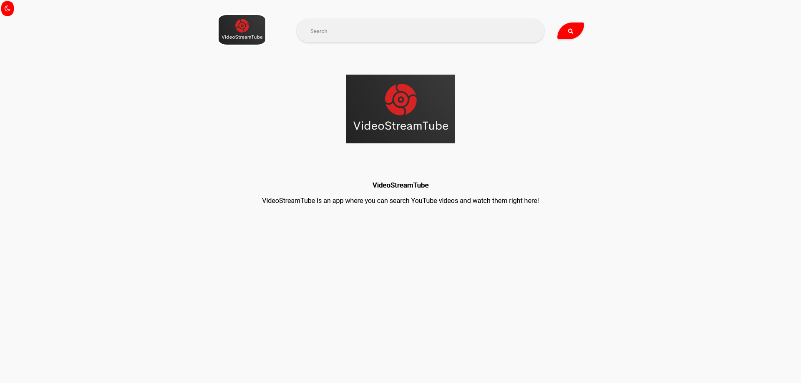

# Video Stream Tube

## Description

This is a simple video streaming application that allows users to watch YouTube videos using this [rapidAPI](https://rapidapi.com/Snowflake107/api/simple-youtube-search).

## Installation

1. Clone the repository
2. Run `npm install`
3. Run `npm run dev` for development mode or `npm start` for production mode

## Images

- Home Page Dark

- Home Page Light

- Search Page

- Single Video Page

